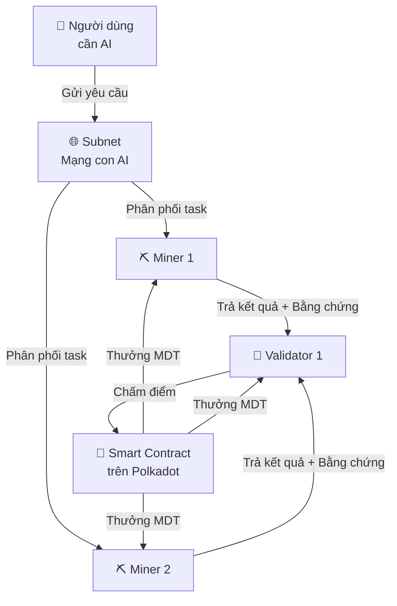

# ModernTensor — Tài Liệu Giới Thiệu Dự Án

**Dành cho người không chuyên kỹ thuật**
Polkadot Solidity Hackathon 2026 — Track 1: EVM Smart Contract

---

## 🤔 Vấn đề: AI đang bị "giam" trong tay vài công ty lớn

Hãy tưởng tượng thế giới AI như hệ thống điện:

> Hiện tại, chỉ có 3-4 "nhà máy điện" khổng lồ (Google, OpenAI, Microsoft) cung cấp AI cho cả thế giới. Nếu họ tăng giá, cắt quyền truy cập, hoặc kiểm duyệt — bạn không có lựa chọn nào khác.

| Vấn đề | Ảnh hưởng |
|--------|-----------|
| AI bị tập trung | Google/OpenAI có thể kiểm duyệt, cắt dịch vụ bất cứ lúc nào |
| Chi phí rất cao | GPU Training tốn hàng triệu USD, rào cản cho startup |
| Không minh bạch | Không ai biết AI trả lời đúng hay sai, không thể kiểm chứng |
| Không công bằng | Người đóng góp tính toán không được thưởng xứng đáng |

---

## 💡 Giải pháp: ModernTensor — "Uber cho AI"

ModernTensor xây dựng một **mạng lưới AI phi tập trung**, nơi:

- **Bất kỳ ai** có máy tính mạnh đều có thể trở thành **"Miner"** — cho thuê sức tính toán AI
- **Validator** kiểm tra chất lượng kết quả AI — đảm bảo tin cậy
- Tất cả được **thưởng token MDT** tự động — ai làm tốt, được nhiều

> 🏠 **Ví dụ đơn giản:** Giống Uber — thay vì một hãng taxi độc quyền, bất kỳ ai có xe đều có thể chạy. ModernTensor cho bất kỳ ai có GPU đều có thể "chạy AI" và kiếm tiền.

---

## 🏗️ Kiến trúc — Cách hệ thống hoạt động



### Giải thích đơn giản:

| Vai trò | Giống như... | Công việc |
|---------|-------------|-----------|
| **Miner** (Thợ đào) | Tài xế Uber | Chạy AI, trả lời yêu cầu, kiếm MDT |
| **Validator** (Kiểm chứng) | Quản lý chất lượng | Kiểm tra Miner làm đúng không, chấm điểm |
| **Subnet** (Mạng con) | Hãng taxi chuyên tuyến | Mỗi subnet chuyên 1 lĩnh vực AI (NLP, Tài chính, Code...) |
| **Smart Contract** | Luật chơi tự động | Tự động thưởng/phạt dựa trên chất lượng |

---

## 🔐 Điểm đặc biệt — Tại sao tin tưởng được?

### 1. Bằng chứng toán học (zkML)

> Giống như khi bạn nộp bài thi, không chỉ có đáp án mà còn có **bài giải chi tiết** để giám khảo kiểm tra. Miner không chỉ trả kết quả AI mà còn phải đính kèm **bằng chứng toán học** (zero-knowledge proof) để chứng minh đã tính toán thật.

### 2. Đồng thuận Yuma (Enhanced Yuma Consensus)

> Giống như hệ thống đánh giá Shopee — nếu 10 validator đều nói miner A làm tốt, thì miner A được thưởng nhiều. Nếu chỉ 1 validator nói tốt mà 9 người khác nói xấu → validator đó bị giảm uy tín.

| Cơ chế bảo mật | Giải thích đơn giản |
|----------------|-------------------|
| **Quadratic Voting** | Cá mập không thể thao túng — người có nhiều tiền chỉ có ảnh hưởng vừa phải |
| **Self-vote Protection** | Không thể tự cho mình điểm cao — miner và validator phải là người khác nhau |
| **Commit-Reveal** | Trước khi chấm điểm, phải "niêm phong" câu trả lời — không ai copy được |
| **Trust Score** | Validator nào chấm điểm chính xác → tăng uy tín → ảnh hưởng lớn hơn |
| **Slashing** | Gian lận → bị phạt mất tiền stake |

### 3. Xây trên Polkadot

> ModernTensor chạy trên **Polkadot** — blockchain hàng đầu thế giới về bảo mật và khả năng mở rộng. Giống như mở quán trên mặt tiền Nguyễn Huệ thay vì hẻm nhỏ — chia sẻ hạ tầng bảo mật cấp cao nhất.

---

## 💰 Token MDT — Kinh tế học đồng tiền

| Thông số | Giá trị |
|----------|---------|
| Tên | **ModernTensor (MDT)** |
| Tổng cung tối đa | **21,000,000 MDT** (giống Bitcoin — có giới hạn) |
| Phát thải | **Thích ứng** (0 → 2,876 MDT/ngày, giảm dần) |
| Cơ chế đốt | **4 loại** — giảm nguồn cung, tăng giá trị |

### Phân bổ token:

```
Phần thưởng cho Miner/Validator  ████████████████████░░░░  45%
Hệ sinh thái & Grants           █████░░░░░░░░░░░░░░░░░░  12%  
Kho bạc DAO                     ████░░░░░░░░░░░░░░░░░░░  10%
Đội ngũ phát triển              ████░░░░░░░░░░░░░░░░░░░  10%
Bán Private                     ███░░░░░░░░░░░░░░░░░░░░   8%
IDO (bán công khai)             ██░░░░░░░░░░░░░░░░░░░░░   5%
Thanh khoản                     ██░░░░░░░░░░░░░░░░░░░░░   5%
Quỹ dự phòng                   ██░░░░░░░░░░░░░░░░░░░░░   5%
```

### So sánh với Bittensor (đối thủ chính):

| Tiêu chí | ModernTensor | Bittensor | Ai hơn? |
|----------|-------------|-----------|---------|
| Phát thải hàng ngày | 0-2,876 (thích ứng) | 7,200 (cố định) | ✅ MDT ít lạm phát hơn |
| Rào cản tham gia | **0 MDT** (ai cũng chạy được) | 1,000+ TAO (~$400+) | ✅ MDT dễ tiếp cận hơn |
| Kiểm chứng AI | **zkML** (bằng chứng toán học) | ❌ Không có | ✅ MDT tin cậy hơn |
| Đốt token | 4 cơ chế | Không có | ✅ MDT bền vững hơn |
| Blockchain | **Polkadot** (cross-chain) | Riêng (cô lập) | ✅ MDT kết nối tốt hơn |

---

## 🏛️ Các "tòa nhà" trong hệ thống (Smart Contracts)

ModernTensor có **6 smart contract cốt lõi**, mỗi cái đảm nhận một chức năng:

| Smart Contract | Vai trò | Ví dụ dễ hiểu |
|---------------|---------|---------------|
| **MDTToken** | Đồng tiền MDT | Tiền mặt trong hệ thống |
| **MDTVesting** | Khóa token theo lịch | Sổ tiết kiệm — mở khóa dần |
| **MDTStaking** | Gửi tiền để tham gia | Đặt cọc để được tham gia mạng |
| **SubnetRegistry** | Quản lý mạng con, đồng thuận, phần thưởng | "Bộ não" điều phối toàn bộ |
| **ZkMLVerifier** | Kiểm tra bằng chứng AI | Giám khảo kiểm tra bài thi |
| **AIOracle** | Nhận/trả yêu cầu AI | Quầy tiếp nhận đơn hàng AI |

---

## 🌐 Các lĩnh vực AI được hỗ trợ

ModernTensor không chỉ chạy 1 loại AI — mỗi **Subnet** (mạng con) phục vụ một lĩnh vực riêng:

| Subnet | Lĩnh vực | Ứng dụng thực tế |
|--------|----------|-----------------|
| 🗣️ NLP | Xử lý ngôn ngữ | Chatbot, phân tích cảm xúc, dịch thuật |
| 💰 Finance | Tài chính | Đánh giá rủi ro, dự đoán thị trường |
| 🔍 Code | Kiểm tra mã nguồn | Phát hiện lỗ hổng bảo mật smart contract |
| 🖼️ Vision | Xử lý hình ảnh | Nhận diện, phân loại ảnh y tế |
| 🏥 Health | Y tế | Hỗ trợ chẩn đoán, phân tích gen |
| ⚡ Custom | Tùy chỉnh | Bất kỳ mô hình AI nào |

> Bất kỳ ai cũng có thể **tạo Subnet mới** cho lĩnh vực AI của mình — hoàn toàn tự do và mở.

---

## 🎬 Demo thực tế — Đã triển khai trên Polkadot Hub Testnet

Dự án đã được **triển khai thực** trên blockchain Polkadot (testnet), không chỉ là lý thuyết:

### ✅ Kết quả demo on-chain:

| Hạng mục | Chi tiết |
|----------|---------|
| **Mạng** | Polkadot Hub Testnet (chainId 420420417) |
| **Contracts deployed** | 6/6 smart contract đã triển khai |
| **Subnet** | "ModernTensor AI" — 5 nodes hoạt động |
| **Miners** | 2 miners đang xử lý AI tasks |
| **Validators** | 3 validators đánh giá và chấm điểm |
| **Epochs chạy** | 10+ epochs, phần thưởng MDT phân phối thành công |
| **Phần thưởng** | Miners nhận 42+ MDT/epoch, Validators nhận 1-6 MDT/epoch |

### 💰 Số dư on-chain (dữ liệu thật):

| Tài khoản | Số dư MDT |
|-----------|-----------|
| Miner | 846.04 MDT (bao gồm 46 MDT reward) |
| Validator | 706.83 MDT (bao gồm 6.8 MDT reward) |
| Emission Pool | 1,000,547 MDT (sẵn sàng thưởng) |

> 🔗 Tất cả dữ liệu trên đều có thể kiểm chứng trực tiếp trên blockchain — hoàn toàn minh bạch.

---

## 🗺️ Lộ trình phát triển

| Giai đoạn | Thời gian | Nội dung | Trạng thái |
|-----------|-----------|----------|-----------|
| **Nền tảng** | Q1 2026 | Smart contracts, SDK, Deploy testnet | ✅ Hoàn thành |
| **Tăng trưởng** | Q2 2026 | Mainnet, TGE, 3 Subnet đầu tiên | 🔄 Đang chuẩn bị |
| **Mở rộng** | Q3-Q4 2026 | 100+ Validators, Bridges cross-chain | 📅 Lên kế hoạch |
| **Trưởng thành** | 2027+ | 1000+ Subnets, DAO tự quản | 📅 Tầm nhìn |

---

## 🏆 Tại sao ModernTensor đặc biệt?

| # | Ưu thế | Chi tiết |
|---|--------|---------|
| 1 | **AI + Blockchain thực sự** | Không chỉ token, mà có AI inference + zkML proof thật |
| 2 | **Deployed thực** | 6 contracts trên Polkadot testnet, 10+ epochs đã chạy |
| 3 | **Kinh tế bền vững** | 72-99% ít lạm phát hơn Bittensor |
| 4 | **An toàn** | 5+ cơ chế chống gian lận (quadratic voting, slashing, commit-reveal...) |
| 5 | **Mở cho tất cả** | 0 MDT để bắt đầu — không rào cản |
| 6 | **Đa lĩnh vực** | Không giới hạn 1 loại AI — NLP, Tài chính, Code, Y tế... |
| 7 | **SDK hoàn chỉnh** | Python SDK 60,000+ dòng code cho developer |
| 8 | **Polkadot native** | Cross-chain, bảo mật chia sẻ, phí thấp |

---

## 📊 Tóm tắt 1 câu

> **ModernTensor** là nền tảng cho phép bất kỳ ai có máy tính mạnh đều có thể "cho thuê" sức mạnh AI và kiếm tiền, với kết quả được kiểm chứng bằng toán học (zkML), hoạt động minh bạch trên blockchain Polkadot — tạo ra một mạng lưới AI phi tập trung, công bằng và bền vững.

---

*ModernTensor — Xây dựng tương lai AI phi tập trung trên Polkadot*
