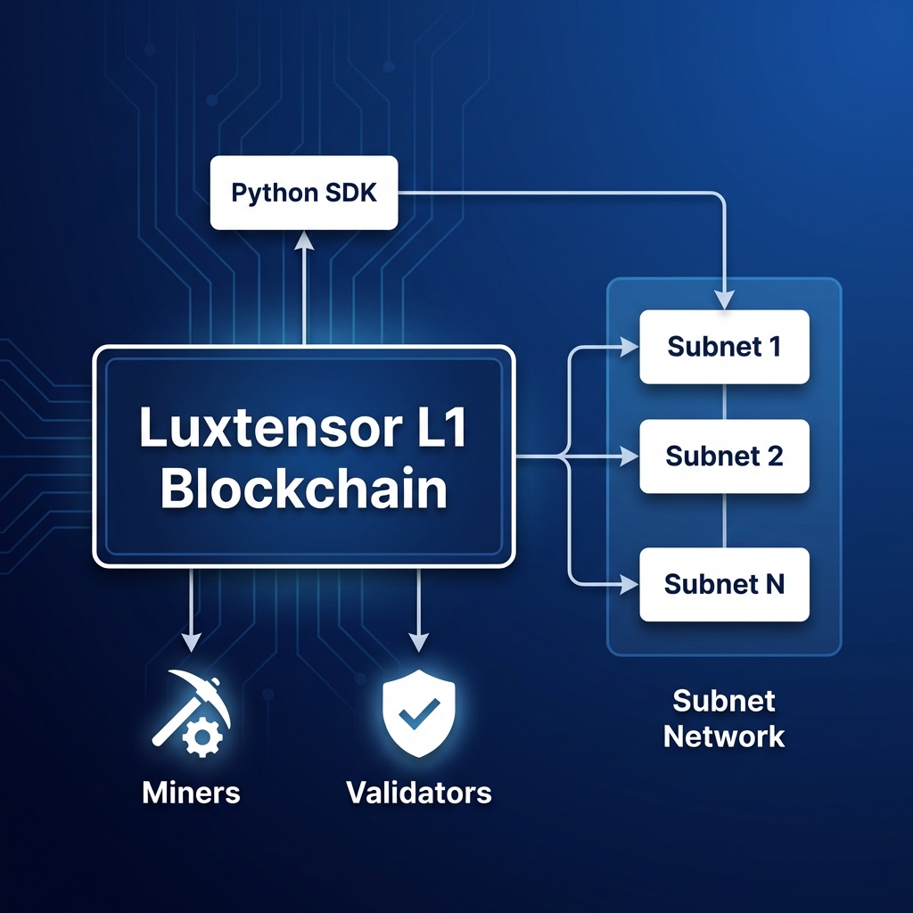
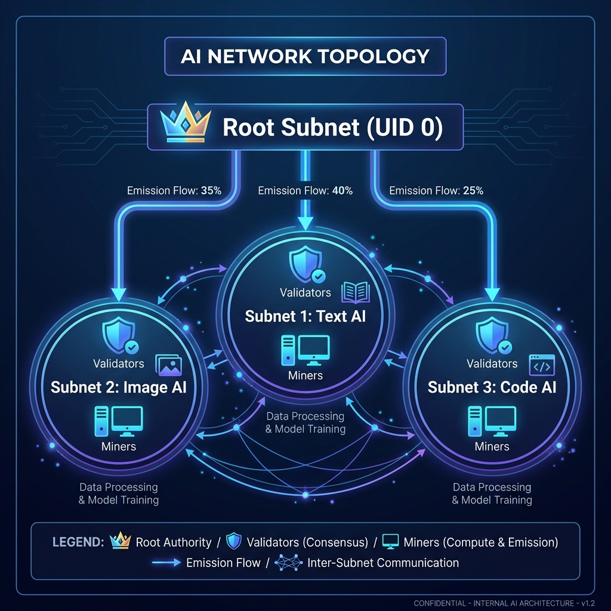
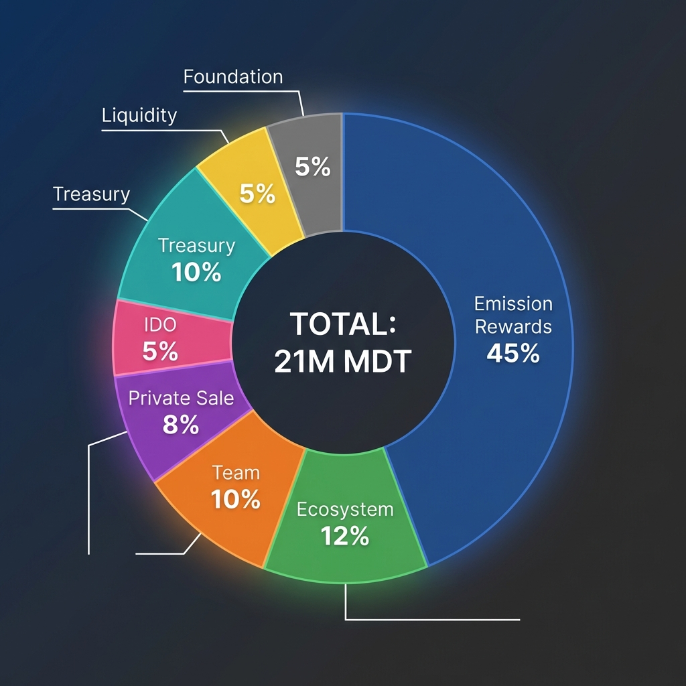
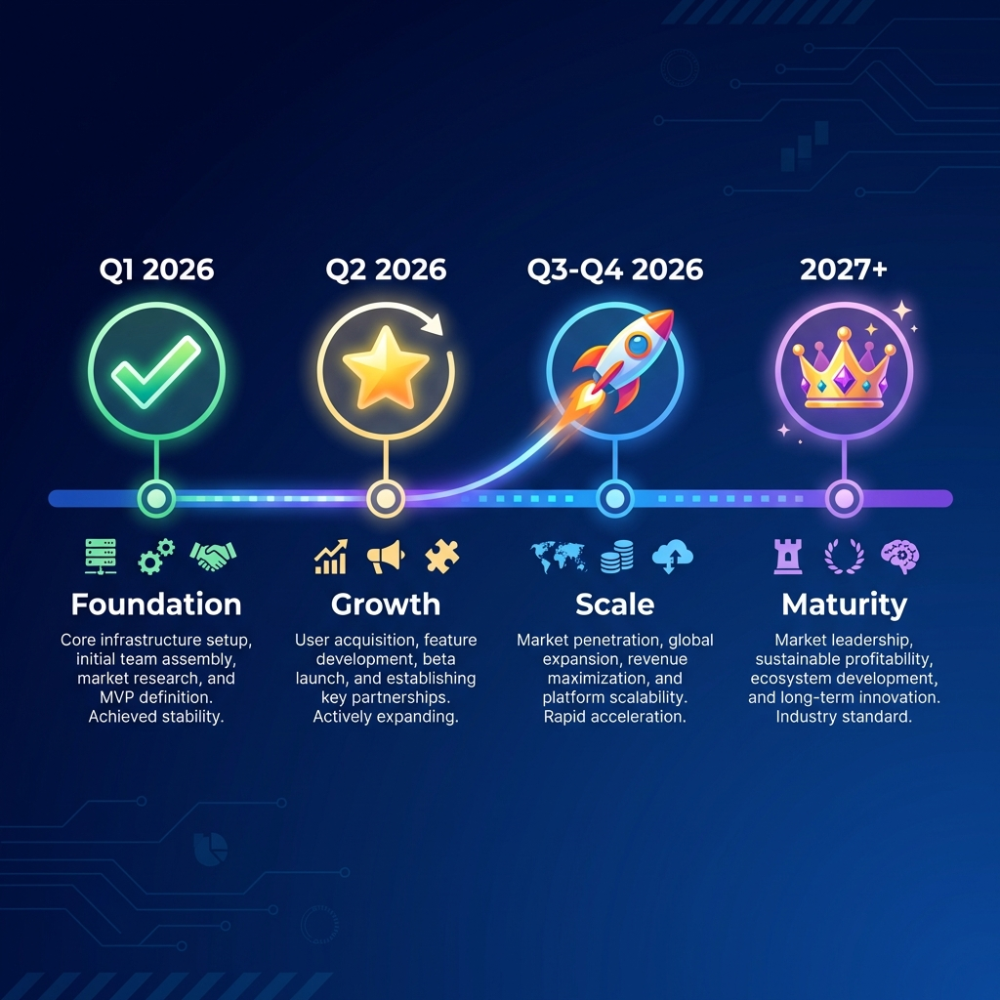

# ModernTensor Pitch Deck

**Decentralized AI Infrastructure for the Next Generation**

---

## 1. Problem Statement

### The AI Compute Crisis

```
┌─────────────────────────────────────────────────────────────────┐
│  💰 AI training costs are exploding                             │
│  🔒 GPU access is centralized (NVIDIA, cloud providers)         │
│  ⚠️ Current solutions lack economic sustainability              │
│  🎯 Existing networks are vulnerable to gaming/cheating         │
└─────────────────────────────────────────────────────────────────┘
```

| Problem | Impact |
|---------|--------|
| Centralized AI | Single points of failure, censorship risk |
| High compute costs | Barrier to innovation |
| Unsustainable tokenomics | 7,200+ tokens/day inflation |
| No anti-cheat | Network gaming, unfair rewards |

---

## 2. Solution: ModernTensor

**A decentralized AI protocol deployed on Polkadot Hub via pallet-revive EVM**



### Key Features

| Feature | Benefit |
|---------|---------|
| **Polkadot Hub EVM** | Shared security, cross-chain (XCM), low fees |
| **On-chain AI Verification** | zkML proofs (STARK/Groth16) for quality assurance |
| **Adaptive Emission** | 72-99% less inflation than competitors |
| **Federated Learning** | On-chain FedAvg with gradient aggregation |
| **Anti-Cheat System** | Fair, trustworthy network |

---

## 3. Market Opportunity

### Total Addressable Market

```
┌────────────────────────────────────────────────────┐
│  AI Infrastructure Market                          │
│  ├── 2024: $30 Billion                             │
│  ├── 2030: $200 Billion (CAGR 35%)                 │
│  └── Decentralized AI: $50B opportunity            │
├────────────────────────────────────────────────────┤
│  ModernTensor Target: 5-10% market share           │
│  = $2.5 - $5 Billion opportunity                   │
└────────────────────────────────────────────────────┘
```

### Why Now?

- AI demand outpacing centralized supply
- Crypto infrastructure maturing
- Enterprise adoption accelerating
- Regulatory clarity emerging

---

## 4. Technology Stack



### Core Components

| Layer | Technology | Status |
|-------|------------|--------|
| **Blockchain** | Polkadot Hub (pallet-revive EVM) | ✅ Deployed |
| **Consensus** | PoS + AI Validation (SubnetRegistry) | ✅ Complete |
| **zkML Verification** | STARK/Groth16 proof verification | ✅ Complete |
| **Federated Learning** | GradientAggregator + TrainingEscrow | ✅ Complete |
| **SDK** | Python + Solidity | ✅ Complete |
| **Security** | Feb 2026 Hardening | ✅ Complete |

### Technical Specs

| Metric | Value |
|--------|-------|
| Platform | Polkadot Hub (Westend AssetHub) |
| EVM Compatibility | pallet-revive |
| Smart Contracts | 9 core + 8 templates |
| Code Lines | 60,000+ |
| Chain ID | 420420421 |
| Status | **Deployed on Testnet** |

---

## 5. Tokenomics ($MDT)



### Key Metrics

| Metric | Value |
|--------|-------|
| **Max Supply** | 21,000,000 MDT |
| **Emission** | Adaptive (0-2,876/day) |
| **Burns** | 4 mechanisms |
| **Entry** | 0 MDT minimum |

### Distribution

| Allocation | Percentage |
|------------|------------|
| Emission Rewards | 45% |
| Ecosystem Grants | 12% |
| Team & Dev | 10% |
| Private Sale | 8% |
| IDO | 5% |
| Treasury | 10% |
| Liquidity | 5% |
| Foundation | 5% |

---

## 6. Competitive Advantage

### vs. Bittensor (TAO)

| Feature | ModernTensor | Bittensor |
|---------|--------------|-----------|
| Daily Emission | 0-2,876 adaptive | 7,200 fixed |
| **Platform** | Polkadot Hub (EVM) | Custom Substrate L1 |
| **zkML Verification** | On-chain (STARK/Groth16) | ❌ None |
| Burn Mechanisms | 4 types | None |
| Entry Barrier | 0 MDT | 1000+ TAO |
| Cross-chain | XCM native | ❌ None |

**Result: 72-99% less inflation with Polkadot's shared security**

---

## 7. Team & Advisors

### Core Team

| Role | Name | Background |
|------|------|------------|
| **CEO** | *[TBD]* | - |
| **CTO** | *[TBD]* | - |
| **Lead Dev** | *[TBD]* | - |

### Advisors

| Name | Role | Background |
|------|------|------------|
| *[TBD]* | Technical Advisor | - |
| *[TBD]* | Business Advisor | - |

*Team section to be completed*

---

## 8. Traction & Milestones

### Completed ✅ (Deployed on Polkadot Hub)

- [x] Smart contract stack deployed on Polkadot Hub (pallet-revive EVM)
- [x] PoS Consensus Engine + Proof of Intelligence (SubnetRegistry)
- [x] **zkML Proof Verification** (ZkMLVerifier contract)
- [x] **Federated Learning** (GradientAggregator + TrainingEscrow)
- [x] **AI Oracle** — Decentralized AI request/fulfill
- [x] Security Hardening (Feb 2026)
- [x] Python + Solidity SDK — 60,000+ lines

### In Progress 🔄

- [ ] Testnet Public Launch (Q1 2026)
- [ ] zkML Verification (Phase 2)

### Upcoming 📅

- Mainnet: Q2 2026
- TGE: Q3 2026
- First 3 Subnets: June 2026

---

## 9. Roadmap



| Phase | Timeline | Milestones |
|-------|----------|------------|
| **Foundation** | Q1 2026 ✅ | L1 Blockchain, SDK, Testnet |
| **Growth** | Q2 2026 | Mainnet, TGE, First Subnets |
| **Scale** | Q3-Q4 2026 | 100+ Validators, Bridges |
| **Maturity** | 2027+ | 1000+ Subnets, DAO |

---

## 10. The Ask

### Funding Round

| Metric | Value |
|--------|-------|
| **Raising** | $2-3M |
| **Valuation** | $25M FDV |
| **Allocation** | 8% (Private Sale) |
| **Vesting** | 1yr cliff + 2yr linear |

### Use of Funds

| Category | % | Amount |
|----------|---|--------|
| Development | 40% | $1.2M |
| Marketing | 25% | $750K |
| Liquidity | 15% | $450K |
| Operations | 12% | $360K |
| Security/Audits | 8% | $240K |

---

## 11. Why Invest?

### Investment Thesis

✅ **Working Product** - Deployed on Polkadot Hub testnet
✅ **On-chain AI** - zkML verification + federated learning
✅ **Superior Economics** - 72-99% less inflation
✅ **Defensible Tech** - HNSW + AI SDK moat
✅ **Clear Roadmap** - Mainnet Q2 2026
✅ **Growing Market** - $200B by 2030

### Exit Potential

- DEX Listing: Q2 2026
- CEX Listings: Q3 2026
- M&A potential: Enterprise adoption

---

## Contact

| Channel | Contact |
|---------|---------|
| **Email** | <invest@moderntensor.io> |
| **Website** | moderntensor.io |
| **Docs** | docs.moderntensor.io |
| **GitHub** | github.com/moderntensor |

---

*ModernTensor Foundation - Building the Future of Decentralized AI*

**Confidential - For Investor Review Only**
