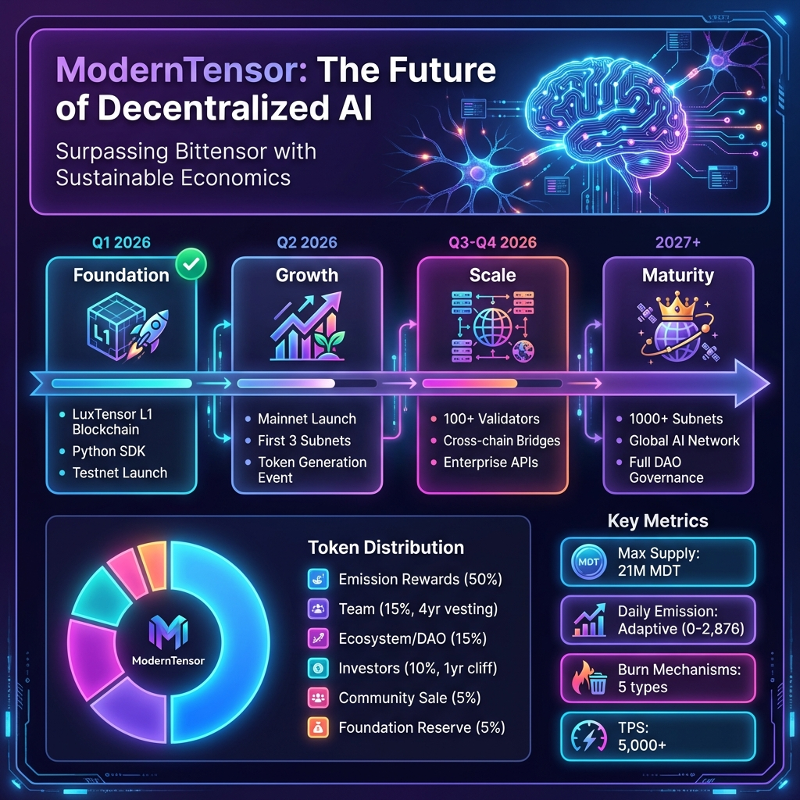
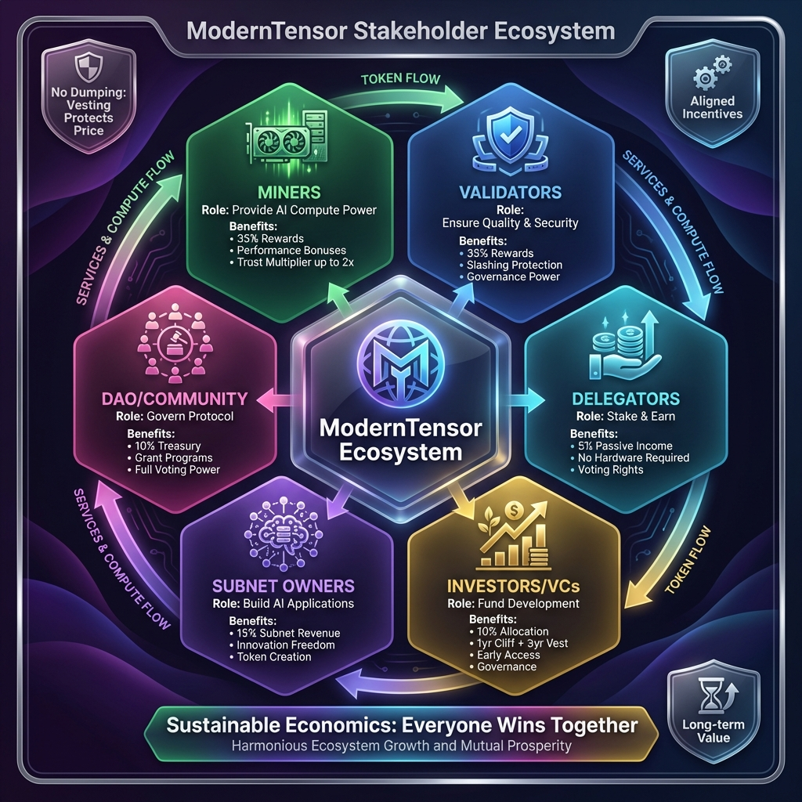

# ModernTensor Roadmap & Vision

## The Future of Decentralized AI

ModernTensor is building the world's most sustainable and efficient decentralized AI infrastructure, designed to surpass Bittensor with superior economics, technology, and stakeholder alignment.

---

## 🗺️ Project Roadmap

### Phase 1: Foundation (Q1 2026) ✅ COMPLETED

**Status: ~95% Complete - Security Hardening Complete!**

| Milestone | Status | Description |
|-----------|--------|-------------|
| LuxTensor L1 Blockchain | ✅ | Custom blockchain optimized for AI |
| Python SDK | ✅ | Full-featured developer toolkit |
| Testnet Launch | ✅ | Running with validators |
| Core Consensus | ✅ | PoS + Proof of Intelligence |
| Tokenomics Implementation | ✅ | Adaptive emission system |
| **Native AI Integration** | ✅ | AI Precompiles (0x22-0x28) |
| **HNSW Semantic Layer** | ✅ | O(log N) Vector Search in StateDB |
| **World Semantic Index** | ✅ | Cross-contract intelligence (0x27-0x28) |
| **Security Hardening** | ✅ | Feb 2026 Remediation (AA-01, VT-01, CR-10, CR-12, CR-01) |

#### Native AI Capabilities (Unique to ModernTensor)

| Precompile | Address | Function |
|------------|---------|----------|
| VectorSimilarity | `0x22` | Cosine similarity for embeddings |
| MatrixMultiply | `0x23` | Optimized BLAS operations |
| Sigmoid/Softmax | `0x24` | Activation functions |
| SemanticSearch | `0x25` | HNSW-based vector search |
| HashEmbedding | `0x26` | Deterministic embedding hashing |
| SemanticStore | `0x27` | World Semantic Index storage |
| SemanticQuery | `0x28` | Cross-contract semantic queries |

### Phase 2: Growth (Q2 2026)

**Status: In Progress**

| Milestone | Timeline | Description |
|-----------|----------|-------------|
| Mainnet Launch | Q2 2026 | Production network go-live |
| Token Generation Event (TGE) | Q3 2026 | Public token availability |
| First 3 Subnets | June 2026 | Text, Image, Code AI subnets |
| Validator Onboarding | Q2 2026 | 50+ initial validators |
| Exchange Listings | Q2 2026 | Major CEX/DEX listings |

### Phase 3: Scale (Q3-Q4 2026)

| Milestone | Timeline | Description |
|-----------|----------|-------------|
| 100+ Validators | Q3 2026 | Decentralized validation |
| Cross-chain Bridges | Q3 2026 | ETH, BSC, Polygon bridges |
| Enterprise APIs | Q4 2026 | B2B AI-as-a-Service |
| Mobile Wallet | Q4 2026 | iOS/Android support |
| zkML Integration | Q4 2026 | Zero-knowledge ML proofs |

### Phase 4: Maturity (2027+)

| Milestone | Timeline | Description |
|-----------|----------|-------------|
| 1000+ Subnets | 2027 | Diverse AI applications |
| Global AI Network | 2027 | Worldwide inference network |
| Full DAO Governance | 2027 | Community-controlled protocol |
| Regulatory Compliance | 2027 | Enterprise-ready compliance |
| AI Agent Marketplace | 2028 | Autonomous AI economy |

---

## 🤝 Stakeholder Ecosystem

### Harmonized Incentives: Everyone Wins Together

ModernTensor creates a self-reinforcing ecosystem where all participants benefit from network growth:

---

### 1. Miners (35% Rewards)

**Role:** Provide AI Compute Power

| Benefit | Description |
|---------|-------------|
| Base Rewards | 35% of epoch emission |
| Performance Bonuses | Up to +40% for high quality |
| Trust Multiplier | 2x rewards for long-term participation |
| No Lockup Required | Flexible participation |

**Why Join:** Highest compute rewards in decentralized AI, with bonuses that reward excellence.

---

### 2. Validators (28% Rewards)

**Role:** Ensure Quality & Security

| Benefit | Description |
|---------|-------------|
| Base Rewards | 28% of epoch emission |
| Governance Power | Proposal voting rights |
| Slashing Protection | Insurance mechanisms |
| Delegator Attraction | Earn from delegated stake |

**Why Join:** Critical network role with strong economic incentives and governance influence.

---

### 3. Delegators (12% Rewards + Lock Bonus)

**Role:** Stake & Earn Passively

| Benefit | Description |
|---------|-------------|
| Passive Income | 12% of epoch emission |
| Lock Bonuses | +10% (30d), +25% (90d), +50% (180d), +100% (365d) |
| No Hardware | Zero technical requirements |
| Voting Rights | Participate in governance |

**Why Join:** Earn up to 2x rewards with lock bonus, perfect for long-term holders.

---

### 4. Investors/VCs (10% Allocation)

**Role:** Fund Development

| Benefit | Description |
|---------|-------------|
| Allocation | 10% of total supply |
| Vesting | 1-year cliff + 3-year linear |
| Early Access | Private sale pricing |
| Governance | Advisory voting power |
| Information Rights | Regular updates & reports |

**Why Invest:**

- **Lower inflation** than Bittensor (72-93% less)
- **4 burn mechanisms** create scarcity
- **Vesting protects price** - no dumping
- **Clear roadmap** to mainnet and beyond

---

### 5. Subnet Owners (10% Revenue)

**Role:** Build AI Applications

| Benefit | Description |
|---------|-------------|
| Revenue Share | 10% of subnet emission |
| Year 1 Free Registration | Builder incentive program |
| Token Creation | Launch subnet-specific tokens |
| Grants Available | Up to 100K MDT per subnet |

**Why Build:** Create specialized AI networks with free registration Year 1 and grants.

---

### 6. DAO/Community (13% Treasury)

**Role:** Govern Protocol

| Benefit | Description |
|---------|-------------|
| Treasury | 13% of emission to community |
| Grant Programs | Funding for developers |
| Full Voting | All protocol decisions |
| Transparency | On-chain governance |

**Why Participate:** True ownership of decentralized AI infrastructure.

---

## 💰 Token Distribution

| Allocation | Percentage | Amount | Vesting |
|------------|------------|--------|---------|
| **Emission Rewards** | 45% | 9,450,000 MDT | 10+ years |
| **Ecosystem Grants** | 12% | 2,520,000 MDT | DAO controlled |
| **Team & Development** | 10% | 2,100,000 MDT | 1-year cliff, 4-year vest |
| **DAO Treasury** | 10% | 2,100,000 MDT | Multi-sig controlled |
| **Private Sale** | 8% | 1,680,000 MDT | 1-year cliff, 2-year vest |
| **IDO** | 5% | 1,050,000 MDT | 25% TGE, 6-month vest |
| **Liquidity** | 5% | 1,050,000 MDT | DEX/CEX liquidity |
| **Foundation Reserve** | 5% | 1,050,000 MDT | Multi-sig controlled |

### Vesting Protections

> **No Dumping Risk:** Team and investor tokens are locked with significant cliff and vesting periods, protecting early community members.

---

## 📊 Why ModernTensor Beats Bittensor

| Metric | Bittensor | ModernTensor | Advantage |
|--------|-----------|--------------|-----------|
| Daily Emission | 7,200 TAO (fixed) | 0-2,876 MDT (adaptive) | **72-99% less inflation** |
| Burn Mechanisms | 0 | 4 types | **Deflationary** |
| DAO Treasury | 0% | 10% | **Sustainable development** |
| Delegator Rewards | 0% | 12% | **Passive income option** |
| Trust Scaling | No | Yes (2x) | **Rewards loyalty** |
| TPS | ~100 | 1,000–5,000 | **10-50x faster** |

---

## 🎯 Vision: 2030 and Beyond

### The Endgame

By 2030, ModernTensor aims to be:

1. **The largest decentralized AI network** - 10,000+ subnets
2. **The default infrastructure** for AI agents and applications
3. **Fully community-governed** through mature DAO
4. **Economically sustainable** with balanced emission and burns
5. **Globally distributed** across 100+ countries

### Long-term Sustainability

Our adaptive tokenomics ensure the network remains viable indefinitely:

- **Minimum emission floor** prevents "death spiral"
- **Burn mechanisms** create long-term scarcity
- **DAO treasury** funds ongoing development
- **Governance** allows parameter adjustments

---

## 📞 Get Involved

| Role | Action |
|------|--------|
| **Developers** | Build on our SDK: [docs.moderntensor.io](https://docs.moderntensor.io) |
| **Miners** | Join testnet: [testnet.moderntensor.io](https://testnet.moderntensor.io) |
| **Validators** | Apply for mainnet: [validators@moderntensor.io](mailto:validators@moderntensor.io) |
| **Investors** | Contact: [invest@moderntensor.io](mailto:invest@moderntensor.io) |
| **Community** | Discord: [discord.gg/moderntensor](https://discord.gg/moderntensor) |

---

*ModernTensor Foundation - Building the Future of Decentralized AI*

**© 2026 ModernTensor Foundation. All rights reserved.**
